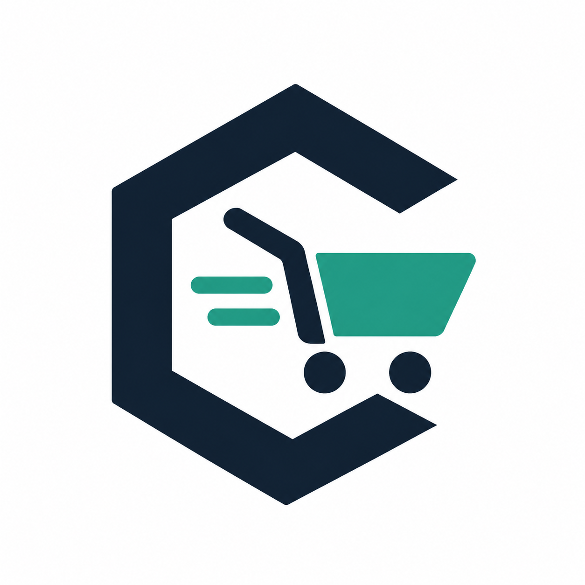
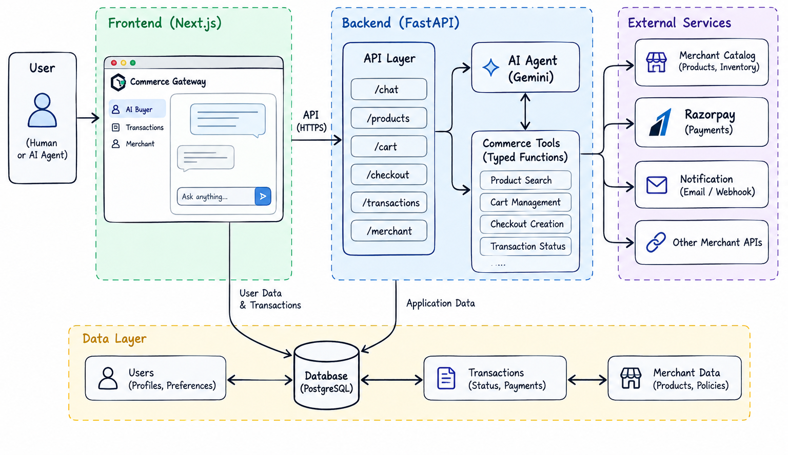

<div align="center">


<h1>Commerce Gateway</h1>

<p>
  <a href="https://commerce-gateway.vercel.app/">
    
  </a>
  <a href="">
    
  </a>
  <a href="https://github.com/ayushHardenIya/EchoWard/blob/main/ARCHITECTURE.md">
    
  </a>
  <a href="https://commerce-gateway.onrender.com/docs">
    
  </a>
</p>

> The commerce gateway for AI buyers — from intent to checkout, with policy, authorization, and payment built in.

*Built for Razorpay’s [Buildathon](https://razorpay.com/buildathon/) · **Track 01 — AI Growth & Agentic Commerce***

</div>

---

## What is Commerce Gateway?

Commerce Gateway is AI-native commerce infrastructure: it lets an AI buyer
discover a merchant's product catalog through a structured interface and carry
out a purchase through a policy-governed, auditable workflow — rather than by
scraping or guessing at a web UI built for humans.

## The problem

AI agents are increasingly asked to shop and buy on someone's behalf, but there
is no reliable, structured way for an agent to do that safely:

- Merchants expose catalogs and checkout flows designed for human browsers, not
  for programmatic buyers.
- There is no standard way to bound what an autonomous agent is allowed to
  spend, on what, or under what authorization.
- Payment execution and business logic often end up entangled with
  probabilistic AI reasoning, which is the wrong place for anything that moves
  money.
- There is typically no complete, after-the-fact record of why a given
  purchase happened.

Commerce Gateway addresses this by giving AI buyers a structured, provider-
agnostic interface to merchant catalogs and checkout, with deterministic policy
enforcement and a complete audit trail sitting between "the AI wants to buy
this" and "money actually moved."  

## Architecture



For a detailed breakdown of each layer, see [architecture.md](architecture.md).

## How it will work

The intended end-to-end workflow is:

1. Understand a natural-language shopping request.
2. Discover products through a structured merchant interface.
3. Evaluate and select an appropriate product.
4. Create a cart.
5. Initiate checkout.
6. Pass deterministic transaction-policy checks.
7. Obtain required authorization.
8. Execute payment through a payment-provider integration.
9. Receive an order result.
10. Produce a complete audit trail.

Steps 6–8 are deliberately deterministic: policy checks, authorization, and
payment execution never depend on an LLM's output. AI is used where reasoning
over natural language genuinely helps (understanding the request, selecting a
product) — never in the code path that moves money.

## Project status

**Early stage — repository foundation.** The backend and frontend project
skeletons exist, along with local development infrastructure. The commerce
workflow described above (catalog, cart, checkout, policy, authorization,
payment, audit) has not been implemented yet. See
[ARCHITECTURE.md](ARCHITECTURE.md) for exactly what is implemented today versus
planned.

## Technical Architecture at a glance

Commerce Gateway is an API-first modular monolith:

| Layer | Technology | Role |
|---|---|---|
| **Backend** | Python, FastAPI, Pydantic, SQLAlchemy, Alembic | Owns all domain and business logic; the only component that talks to the database |
| **Frontend** | Next.js (App Router), TypeScript, Tailwind CSS | Presentation layer; talks to the backend only over HTTP |
| **Database** | PostgreSQL | The single system of record |
| **Payments** | Provider-agnostic payment abstraction (Razorpay Test Mode first) | Core architecture does not assume any specific provider |

Full details, including which components are implemented versus planned, are
in [ARCHITECTURE.md](ARCHITECTURE.md).

## Development

### Prerequisites

- Python 3.12+ and [uv](https://docs.astral.sh/uv/)
- Node.js 20+ and npm
- Docker and Docker Compose (for PostgreSQL)

### With Make

A `Makefile` at the repo root wraps the commands below for convenience.
After copying `backend/.env.example` to `backend/.env` and
`frontend/.env.example` to `frontend/.env`:

```bash
make install
make db-up
make db-migrate
make check
```

Then start each development server in its own terminal:

```bash
make dev-backend
make dev-frontend
```

Run `make help` to list all available targets.

### Without Make

If you'd rather run each component directly:

#### 1. Start PostgreSQL

```bash
docker compose up -d
```

This starts a local PostgreSQL instance on `localhost:5432` (see
`docker-compose.yml` for credentials, which are local-development-only).

#### 2. Run the backend

```bash
cd backend
cp .env.example .env
uv sync
uv run uvicorn app.main:app --reload
```

The API is now available at `http://localhost:8000`, with a health check at
`http://localhost:8000/health`. Interactive API docs are at
`http://localhost:8000/docs`.

Run the backend test suite with:

```bash
uv run pytest
```

#### 3. Run the frontend

```bash
cd frontend
cp .env.example .env
npm install
npm run dev
```

The app is now available at `http://localhost:3000` and will report the
backend's health status on the home page.

## Roadmap

Planned, in rough order:

- Merchant catalog module and structured product discovery.
- Cart creation and checkout initiation.
- Deterministic transaction state machine.
- Deterministic policy engine (spend limits, allowed merchants/categories).
- Authorization mechanism.
- Provider-agnostic payment abstraction, with a Razorpay Test Mode adapter.
- Complete audit trail for every transaction.
- AI buyer agent: natural-language request understanding and product selection
  via an LLM with structured tool/function calling.
- End-to-end tests covering the full buyer workflow.

---

<div align="center">

[](LICENSE) [](mailto:ayushhardeniya@gmail.com) [](https://razorpay.com/buildathon)

</div>
